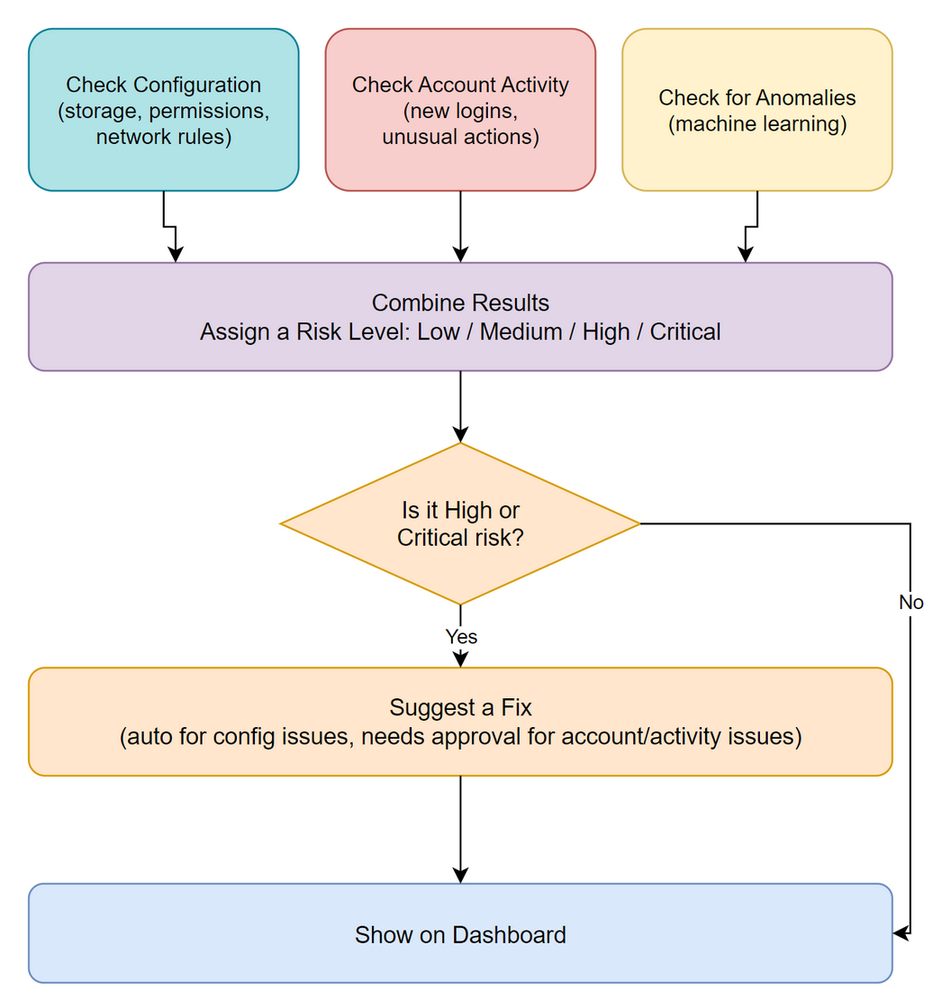
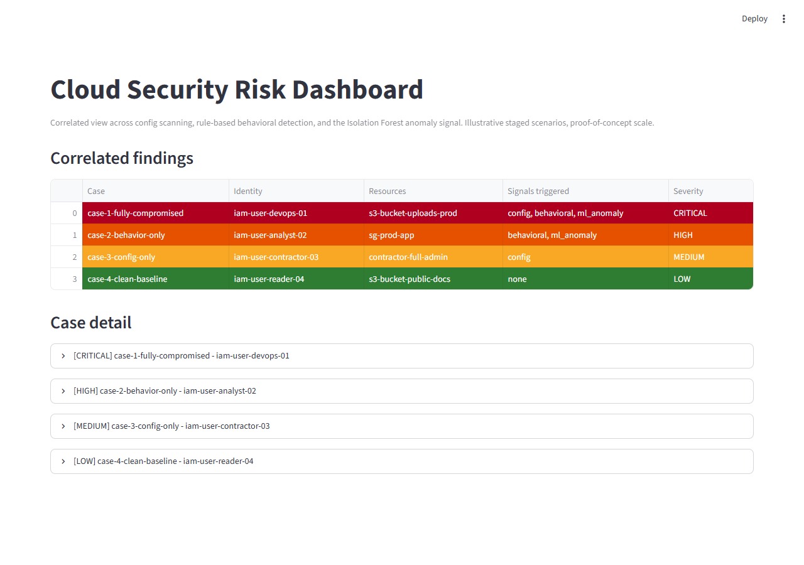

# Cloud Security Risk Framework

Checks an AWS account for risky configurations, suspicious account activity, and unusual behavior patterns — then combines all three into a single risk score instead of three separate alerts.



## Scope

This is a proof-of-concept, not a production tool. A few things to know going in:

- Runs on sample/synthetic data by default — no AWS account needed to try it out.
- The "auto-fix" decision is just that — a decision. It doesn't actually change anything in a real AWS account yet.
- The machine-learning piece is trained on a small sample baseline, not real historical account behavior.

## Quick start

```bash
pip install -r requirements.txt

# Run 4 example scenarios
python run_scenarios.py

# Run a larger 100-case evaluation
python evaluate_batch.py

# Launch the dashboard
streamlit run dashboard.py
```

## Project structure

```
.
├── config_scanner.py        # Checks for risky AWS configurations
├── behavioral_rules.py      # Checks account activity against simple rules
├── ml_anomaly.py             # Machine-learning anomaly scoring
├── correlation_engine.py    # Combines all checks into one risk score
├── remediation_advisor.py   # Decides: auto-fix vs needs human approval
├── scenario_generator.py    # Generates the 100-case test batch
├── evaluate_batch.py        # Runs the evaluation, prints the results
├── run_scenarios.py         # Runs 4 example cases end-to-end
├── dashboard.py              # Streamlit dashboard
└── docs/                     # Diagrams and screenshots
```

## How it works

A resource or account activity gets checked three different ways at once:

1. **Configuration** — is anything set up insecurely? (public storage, overly broad permissions, open network ports)
2. **Account activity** — does anything look unusual? (new access key, login from an unfamiliar place, a burst of activity)
3. **Anomaly detection** — a machine-learning model flags patterns that don't fit what "normal" looks like, even if nobody wrote an explicit rule for it

The more of these three agree something is wrong about the same resource, the higher its risk level — Low, Medium, High, or Critical. High/Critical cases get a suggested fix: automatic for configuration problems (those are plain facts), but anything involving account activity or the ML signal always needs a human to approve first, since that signal can be wrong sometimes.

## Results

Run on a 100-case test batch with known answers, so these numbers are measured, not estimated:

```
config_detection_rate           100.0%
config_false_positive_rate      0.0%
behavioral_detection_rate       100.0%
behavioral_false_positive_rate  0.0%
ml_detection_rate               98.0%
ml_false_positive_rate          15.7%
correlation_accuracy            91.0%

escalated cases (High/Critical)  = 53 / 100
auto-fix decisions                = 52
human-approval recommendations    = 53
```

The configuration and activity checks hit 100%/0% because they're simple rule checks — a setting either matches a known bad pattern or it doesn't. The ML component is the one that's genuinely imperfect, on purpose, since real machine learning isn't 100% either.

## Dashboard



## License

MIT — see [LICENSE](LICENSE).
