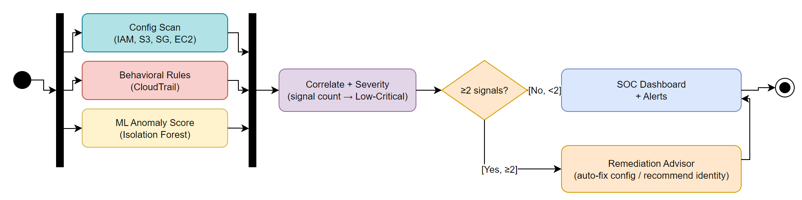

# Cloud Security Risk Framework

A lightweight AWS security tool that correlates **configuration misconfigurations**, **rule-based behavioral anomalies**, and a **machine-learning anomaly signal** into a single, severity-ranked finding — instead of treating them as separate problems, which is how most existing tools and research handle them.

Built as a proof-of-concept for an academic IEEE-format paper. Validated three ways: against a real AWS account, against a 100-case labeled synthetic batch, and through four fully-explained illustrative cases.



## Why

Five recent papers in this space each address one piece of the problem in isolation: behavioral anomaly detection *or* configuration misconfiguration detection *or* automated incident response — never config + behavior correlated together, and never with a response layer that's gated on multiple signals agreeing rather than one isolated alert. Two of those papers independently name this exact disconnect as an open problem. This project builds and validates a system that closes it.

| | Config aware | Behavioral aware | Correlates both | Output |
|---|---|---|---|---|
| Existing approaches (5 papers reviewed) | some | some | **none** | single-signal findings |
| This framework | yes | yes | **yes** | severity-ranked, correlated finding |

## How it works

Three independent signals are collected and evaluated in parallel, then merged:

1. **Configuration scanner** — checks IAM policies, S3 bucket permissions, security groups, and EC2 instance exposure against known misconfiguration patterns (public buckets, wildcard IAM policies, open SSH/RDP, missing IMDSv2 enforcement).
2. **Rule-based behavioral detector** — flags CloudTrail activity against explicit rules: new access key, login from an unfamiliar region, abnormal API call spike.
3. **ML anomaly scorer** — an unsupervised Isolation Forest over CloudTrail activity features (call frequency, time-of-day, source-IP novelty, distinct actions per session). Deliberately independent of the rule-based detector, not a replacement for it — it catches patterns nobody wrote a rule for.

A **correlation engine** then assigns severity purely by how many of these three signals agree on the same resource or identity — not by which signal fired:

| Signals agreeing | Severity |
|---|---|
| 3 | Critical |
| 2 | High |
| 1 | Medium |
| 0 | Low |

Findings at High/Critical severity are passed to a **correlation-gated remediation advisor**: configuration-type findings get an automatic fix decision (they're deterministic facts — 100% detection, 0% false positives in evaluation), while anything touching the behavioral or ML signal only ever produces a human-approval recommendation, never an automatic action, since that signal has a real, measured false-positive rate. This is the key difference from "SOAR"-style tools, which act on a single uncorrelated signal — this only acts once multiple independent signals already agree.

A **SOC-style dashboard** (Streamlit) surfaces everything with severity color-coding:


## Evaluation

Three independent, complementary forms of evidence — kept deliberately separate so no single one is overstated:

- **Live AWS validation** — deliberately misconfigured resources (a public S3 bucket, a wildcard IAM policy, an open security group, a free-tier EC2 instance with IMDSv1 left enabled) were created on a real AWS account, correctly flagged, and immediately torn down.
- **n=100 labeled synthetic batch** — each case carries a known ground truth of which signals were deliberately injected, so detection rates are computed against a known answer rather than a handful of anecdotes.
- **4 illustrative cases** — kept separate from the n=100 batch on purpose: these are worked examples for understanding the mechanism, not a statistical sample.

Real output from the n=100 batch:

```
Metric                          Value
--------------------------------------------------
config_detection_rate           100.0%
config_false_positive_rate      0.0%
behavioral_detection_rate       100.0%
behavioral_false_positive_rate  0.0%
ml_detection_rate               98.0%
ml_false_positive_rate          15.7%
correlation_accuracy            91.0%

Remediation advisor:
  escalated cases (HIGH/CRITICAL, acted on) = 53 / 100
  auto-remediated config actions = 52
  human-approval recommendations = 53
```

Worth being upfront about: the config and behavioral checks hit 100%/0% because they're deterministic rule evaluations — a resource either matches a defined pattern or it doesn't, so that number reflects implementation correctness, not resistance to a sophisticated attacker trying to evade detection. The ML component's 98%/15.7% is the one built to be genuinely imperfect — its test cases are drawn from overlapping, not maximally-separated, distributions, so that result reflects real classifier behavior rather than a number guaranteed by construction.

## Quick start

```bash
pip install -r requirements.txt

# Run the 4 illustrative cases
python run_scenarios.py

# Run the full n=100 evaluation batch
python evaluate_batch.py

# Launch the dashboard
streamlit run dashboard.py
```

No AWS account is required for any of the above — the config/behavioral/ML test data is synthetic, shaped like real boto3/CloudTrail API responses. An optional live path (`config_scanner.scan_live_account(session)`) exists for scanning a real AWS account, given valid AWS credentials.

## Project structure

```
.
├── config_scanner.py        # Configuration misconfiguration checks (IAM, S3, SG, EC2)
├── behavioral_rules.py      # Rule-based CloudTrail behavioral checks
├── ml_anomaly.py             # Isolation Forest anomaly scorer
├── correlation_engine.py    # Combines all 3 signals into a severity level
├── remediation_advisor.py   # Correlation-gated auto-fix / human-approval decision
├── scenario_generator.py    # Generates the labeled n=100 synthetic batch
├── evaluate_batch.py        # Runs the pipeline over the batch, scores against ground truth
├── run_scenarios.py         # Runs the 4 illustrative worked-example cases
├── dashboard.py              # Streamlit SOC-style dashboard
└── docs/                     # Architecture diagram, dashboard screenshot
```

## Scope

This is a proof-of-concept built for an academic paper, not a production security tool. It doesn't handle multi-tenancy, doesn't execute its remediation decisions against a live account (it determines and logs them — see `remediation_advisor.py`), and its ML component is trained on a synthetic baseline rather than per-customer historical behavior. These are explicit, deliberate scope boundaries, not oversights.

## License

MIT — see [LICENSE](LICENSE).
